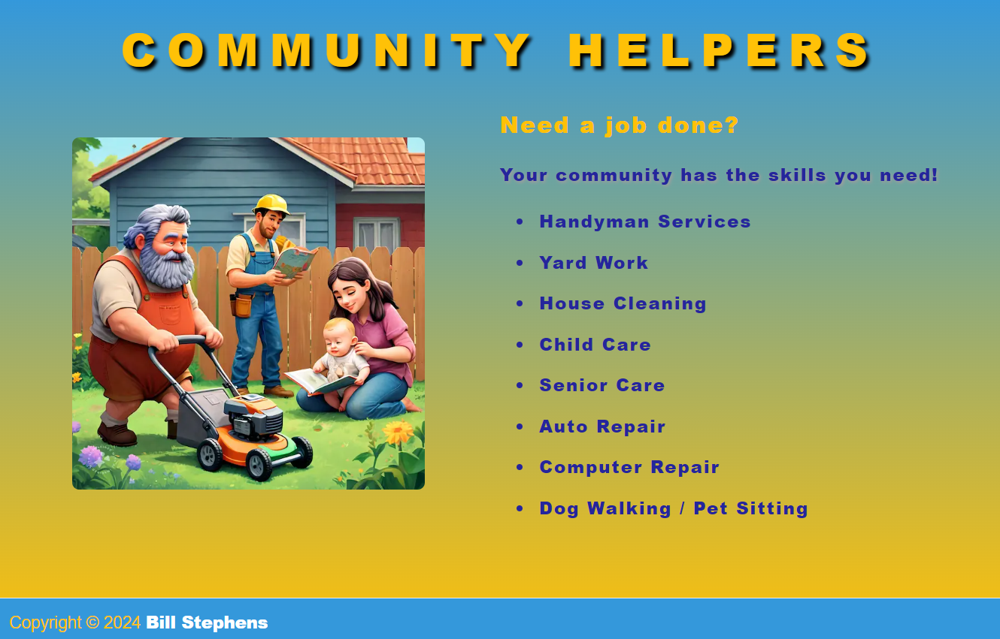

# Community Helpers

## Description

***Note: This is a work in process!***

Community Helper is a work in process and is built with NextJS, React, TypeScript, MongoDB, Mongoose. It uses Recoil for global state management and Cloudinary for image storage and transformations.  This application matches neighbors with skills with neighbors in need.

### App Screenshot

#### Homepage

