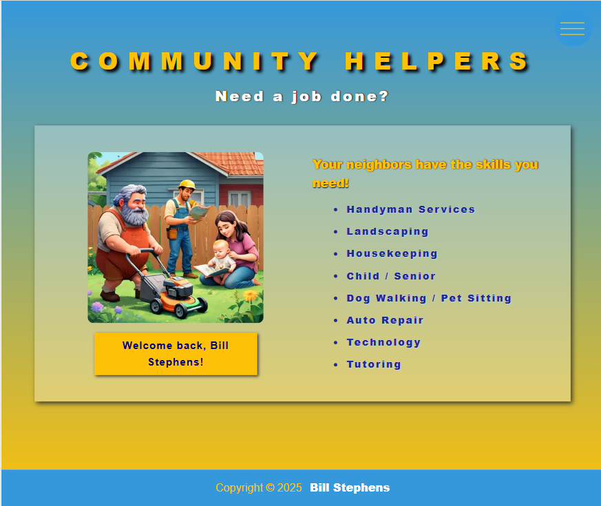
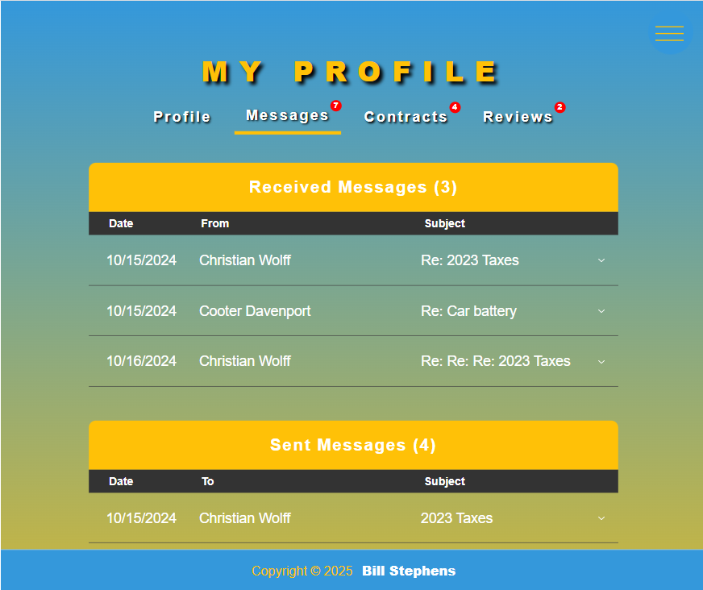

# Community Helpers

## Description
Community Helper is a web application built with NextJS, React, TypeScript, MongoDB, Mongoose. It uses Recoil for global state management and Cloudinary for image storage and transformations.  This application matches neighbors with skills with neighbors in need. Work Contracts can be created and faux payments can be made between parties to satisfy the contracts.  Users can contact one another via messages re: new jobs, etc.  Work Contacts can be proposed, negotiated, and signed off by both parties.

### App Screenshot

#### Homepage

#### About Page

#### Profile Page

#### Community Page

#### Messages

#### Contracts

#### Sample Contracts

#### Reviews

#### Neighbor Profile

## Table of Contents

- [Installation](#installation)
- [Usage](#usage)
- [License](#license)
- [Contributing](#contributing)
- [Tests](#tests)
- [Questions](#questions)

## Installation

Deployed URL:  https://community-helpers.vercel.app

## Usage

Users search for neighbors with the needed skillset, send them a message about the job needed to be done and negotiate a price.  Contracts can be created to detail the terms of the work, and faux payments can be made between the client and worker's wallets.  Users can provide reviews for each other's work.

## License

This application is covered under the MIT License.
 For more information: https://opensource.org/licenses/MIT

## Contributing

N/A

## Tests

N/A

## Questions

Contact Info 
GitHub user name: BillStephens2022 
Link to GitHub profile: https://github.com/BillStephens2022 
Email: stephensbill17@gmail.com
